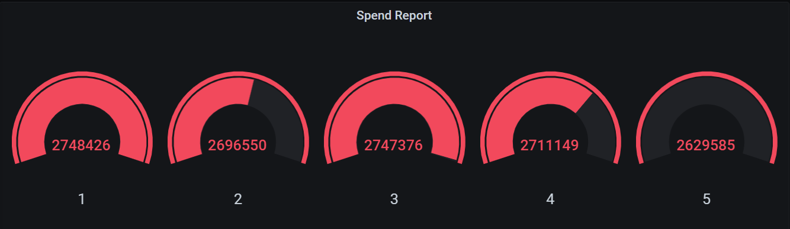

# Flink作业实现

每分钟计算在五分钟内每个账号的平均交易金额（滑动窗口）。

1. 编辑`report`函数实现功能：

   ```java
   public static Table report(Table transactions) {
       return transactions
           // 拆分滑动窗口，步长为1分钟，窗口大小为5分钟
           .window(Slide
                   .over(lit(5).minutes())
                   .every(lit(1).minutes())
                   .on($("transaction_time"))
                   .as("log_ts")
                  )
           // 按账户id和交易时间分组
           .groupBy($("account_id"), $("log_ts"))
           // 聚合结果，log_ts取窗口开始时间，amount取平均值
           .select($("account_id"),
                   $("log_ts").start().as("log_ts"),
                   $("amount").avg().as("amount")
                  );
   }
   ```

2. 编译打包代码: `docker-compose build`

3. 启动环境: `docker-compose up -d`

4. 查看Flink WebUI 界面

   

5. 查看MySQL导入结果

   ```mysql
   docker-compose exec mysql mysql -Dsql-demo -usql-demo -pdemo-sql
   mysql> use sql-demo;
   mysql> select count(*) from spend_report;
   +----------+
   | count(*) |
   +----------+
   |    15410 |
   +----------+
   mysql> select * from spend_report limit 20;
   +------------+-------------------------+--------+
   | account_id | log_ts                  | amount |
   +------------+-------------------------+--------+
   |          1 | 2000-01-01 00:56:00.000 |    767 |
   |          1 | 2000-01-01 00:57:00.000 |    767 |
   |          1 | 2000-01-01 00:58:00.000 |    767 |
   |          1 | 2000-01-01 00:59:00.000 |    767 |
   |          1 | 2000-01-01 01:00:00.000 |    767 |
   |          1 | 2000-01-01 01:24:00.000 |    536 |
   |          1 | 2000-01-01 01:25:00.000 |    536 |
   |          1 | 2000-01-01 01:26:00.000 |    536 |
   |          1 | 2000-01-01 01:27:00.000 |    536 |
   |          1 | 2000-01-01 01:28:00.000 |    536 |
   |          1 | 2000-01-01 01:51:00.000 |     38 |
   |          1 | 2000-01-01 01:52:00.000 |     38 |
   |          1 | 2000-01-01 01:53:00.000 |     38 |
   |          1 | 2000-01-01 01:54:00.000 |     38 |
   |          1 | 2000-01-01 01:55:00.000 |     38 |
   |          1 | 2000-01-01 02:17:00.000 |    997 |
   |          1 | 2000-01-01 02:18:00.000 |    997 |
   |          1 | 2000-01-01 02:19:00.000 |    997 |
   |          1 | 2000-01-01 02:20:00.000 |    997 |
   |          1 | 2000-01-01 02:21:00.000 |    997 |
   +------------+-------------------------+--------+

6. 在 Grafana 查看最终结果

   